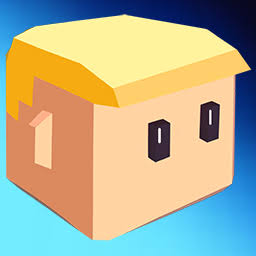
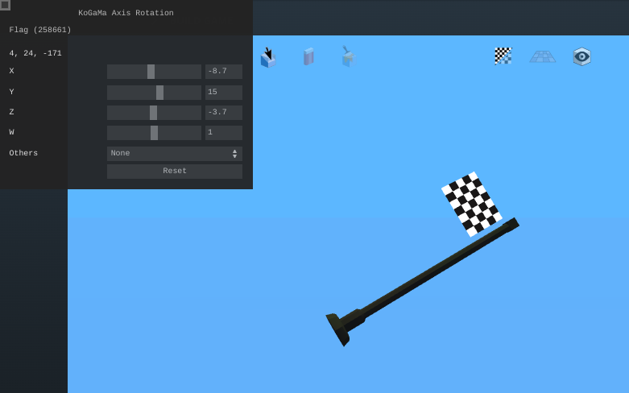

  
  <h1>Axis Rotation</h1>

# About
KoGaMa Axis Rotation is a tool that allows you to rotate objects from different angles. Made only for web and used [`guify`](https://github.com/colejd/guify) to make the interface. 
> For now it will be called Axis Rotation as in the future I will be updating it and adding other tools to improve the build.

# Preview 

# Getting Started
To download this script you need a user-script manager, if you don't have, then check [InstallUserScriptsManager](https://github.com/Devorkk/InstallUserScriptsManager) guide. 
Otherwise, click the button below:

# Usage
Click on any object or move it, then at the top of the interface will appear the name of the object and its id, that means you are ready to rotate it.
